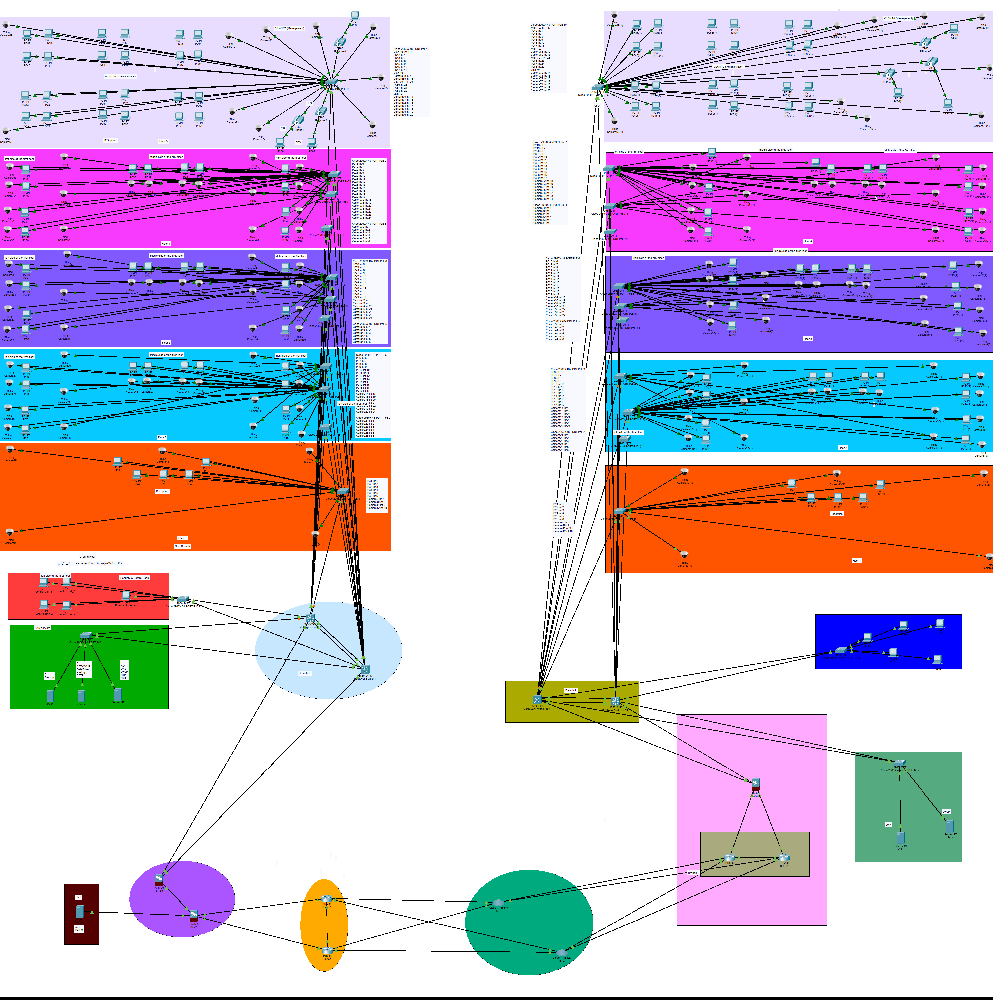

<div align="center">

# 🌐 International Examination Center

### Enterprise Network Infrastructure Design

**Main Site (HQ) • Branch 2 • Cisco Networking • Secure Multi-Site Architecture**

</div>

---

## 📌 About the Project

The **International Examination Center** is an enterprise network design project developed to provide a secure, scalable, redundant, and well-structured network infrastructure for a multi-site examination center.

The project consists of two interconnected sites:

- 🏢 **Main Building (HQ)**
- 🏢 **Branch 2 (Secondary Branch)**

The network supports examination laboratories, administration, IT staff, IP phones, CCTV systems, printers, servers, network management, and Internet/WAN connectivity.

The architecture combines **Layer 3 switching, VLAN segmentation, OSPFv2, firewalls, ACLs, NAT/PAT, IPsec VPN, QoS, IPv4/IPv6, and centralized network services**.

---

# 🏢 Network Sites

<table>
<tr>
<td width="50%" valign="top">

## 🏢 Main Building — HQ

| Component | Quantity |
|---|---:|
| Layer 3 Core/Distribution Switches | 2 |
| Access Switches | 13 |
| WAN/Edge Routers | 2 |
| Firewalls | 2 |
| Central Servers | 5 |
| ISP Connections | 2 |

**Main Functions**

- Examination laboratories
- Administration
- IT and employee area
- IP Phones / VoIP
- CCTV infrastructure
- Network printers
- Centralized servers
- Network monitoring
- DMZ services
- Internet/WAN connectivity

</td>
<td width="50%" valign="top">

## 🏢 Branch 2 — Secondary Branch

| Component | Quantity |
|---|---:|
| Layer 3 Core/Distribution Switches | 2 |
| Access Switches | 10 |
| WAN/Edge Routers | 2 |
| Firewall | 1 |
| Local Servers | 2 |
| ISP Connections | 2 |

**Main Functions**

- Examination laboratories
- Administration
- IT and employee area
- IP Phones / VoIP
- CCTV infrastructure
- Network printers
- Local DHCP services
- Local Camera Server
- Internet/WAN connectivity

</td>
</tr>
</table>

---

# 🏗️ Network Architecture

The project follows a hierarchical enterprise architecture:

**Access Layer → Layer 3 Core / Distribution → Security Layer → WAN / Edge → Internet / ISP**

### 🔗 Inter-Site Connectivity

The two sites are interconnected using redundant WAN connectivity and a site-to-site IPsec VPN.

```text
MAIN BUILDING
HQ-R1 / HQ-R2
      │
      │
  IPsec VPN
      │
      │
BRANCH 2
BR-R1 / BR-R2
```

The WAN architecture includes:

- Two WAN routers per site
- Two ISP paths per site
- Site-to-site IPsec VPN
- Redundant connectivity
- OSPF-based routing
- Controlled inter-site communication

---

# 🔐 VLAN Architecture

| VLAN | Name | Purpose |
|---:|---|---|
| 10 | ADMIN | Administration users |
| 20 | EMPLOYEES | IT and employee users |
| 30 | TEST_CENTER | Examination systems |
| 40 | CCTV | IP cameras |
| 50 | VOICE | IP Phones and VoIP |
| 60 | SERVERS | Server infrastructure |
| 70 | MANAGEMENT | Network management |
| 80 | GUEST | Guest network |
| 90 | PRINTERS_IOT | Printers and IoT devices |
| 100 | DMZ | Public-facing services |
| 999 | NATIVE | Native / unused-port VLAN |

---

# 🌐 IP Addressing

| Site | IPv4 Network |
|---|---|
| Main Site | `10.10.0.0/16` |
| Branch 2 | `10.20.0.0/16` |
| IPv6 | `2001:db8:acad::/48` |

IPv6 subnetting is organized according to the site and VLAN structure.

---

# 🖥️ Network Services

### Main Building

- Active Directory Domain Services
- DNS
- DHCPv4 / DHCPv6
- NTP
- Network Monitoring / Zabbix
- Syslog
- SNMPv3
- Database Services
- Web Services
- IP-PBX / FreePBX-Asterisk
- Backup Services
- CCTV / NVR Services
- SFTP

### Branch 2

- Local DHCPv4 / DHCPv6
- Local CCTV / Camera Server

The branch also communicates with centralized services hosted at the Main Building.

---

# ☎️ VoIP & IP Phones

The network includes a dedicated **VOICE VLAN (VLAN 50)** for IP phones and VoIP traffic.

The VoIP infrastructure includes:

- IP Phones
- IP-PBX / FreePBX-Asterisk
- Dedicated Voice VLAN
- QoS traffic prioritization
- Inter-site VoIP connectivity

---

# 🔄 Routing & Redundancy

**OSPFv2** is used as the internal dynamic routing protocol.

The design includes:

- OSPF Area 0
- Redundant core infrastructure
- Layer 3 EtherChannel
- Two WAN routers per site
- Two ISP paths per site
- Redundant WAN connectivity
- IPsec VPN
- Structured IPv4 and IPv6 addressing

---

# 🛡️ Security Architecture

Security is implemented through multiple network layers.

### Security Technologies

- Firewalls
- VLAN segmentation
- ACLs
- DMZ
- NAT/PAT
- IPsec VPN
- Management network separation
- Restricted management access
- Secure network services

### HQ

```text
HQ Core
   │
  ASA3
   │
  ASA1
   │
WAN / Internet
```

### Branch 2

```text
Branch Core
    │
   ASA22
    │
WAN / Internet
```

---

# 🌍 DMZ

The Main Building contains a dedicated DMZ for externally accessible services.

| Parameter | Value |
|---|---|
| VLAN | 100 |
| Network | `10.10.100.0/24` |
| Web Server | `10.10.100.10` |

The DMZ is separated from internal network resources through firewall security policies.

---

# 🔥 NAT & ACL

### NAT

- PAT / NAT Overload for internal networks
- Separate HQ and Branch NAT policies
- Static NAT for the DMZ Web Server

### ACL

ACL policies control:

- Network management access
- DMZ access
- Web traffic
- HTTPS traffic
- ICMP reachability
- Access to protected services

---

# 🚦 Quality of Service

| Class | Traffic | Treatment |
|---|---|---|
| **REALTIME** | VoIP / IP-PBX | Strict Priority / LLQ |
| **WEB** | HTTP / HTTPS | Best Effort |
| **MGMT** | SSH / SNMP / Syslog | Guaranteed Bandwidth |

VoIP traffic receives priority treatment to reduce latency and jitter.

---

# 📊 Project Scale

| Component | Main Site | Branch 2 | Total |
|---|---:|---:|---:|
| PCs | 191 | 137 | **328** |
| IP Cameras | 203 | 143 | **346** |
| Printers | 9 | 9 | **18** |
| Core Switches | 2 | 2 | **4** |
| Access Switches | 13 | 10 | **23** |
| WAN Routers | 2 | 2 | **4** |
| Firewalls | 2 | 1 | **3** |
| IP Phones / VoIP | Supported | Supported | **VLAN 50** |

---

# 🖼️ Logical Network Design

The logical network topology was developed using **Cisco Packet Tracer**.

<div align="center">



</div>

---

# 🗺️ Physical Network Design

The physical network design was developed using **Microsoft Visio**.

### 📄 Physical Design

[**🗺️ Open Physical Network Design — Physical_Design.pdf**](./Physical-Design/Physical_Design.pdf)

---

# 📚 Project Documentation

The complete technical documentation is available here:

[**📚 Open Project Documentation — توثيق المشروعV3.pdf**](./Documentation/توثيق%20المشروعV3.pdf)

The documentation covers:

1. Project Overview
2. Site and Building Overview
3. Physical Network Design
4. Network Architecture
5. Logical Network Design
6. VLAN and Network Segmentation
7. IP Addressing Plan
8. Layer 2 Technologies
9. Layer 3 Routing
10. WAN and Internet Connectivity
11. Security Architecture
12. Quality of Service
13. Network Services
14. Conclusion

---

# 🎤 Project Presentation

[**🎤 Open Project Presentation — Secure Exam Network Architecture**](./Presentation/Secure_Exam_Network_Architecture.pdf)

---

# 🛠️ Design & Documentation Tools

| Tool | Purpose |
|---|---|
| **Cisco Packet Tracer** | Logical network design and configuration |
| **Microsoft Visio** | Physical network design |
| **Microsoft Word** | Technical documentation |
| **Microsoft PowerPoint** | Project presentation |
| **PDF** | Final exported documentation and designs |

---

# 🎯 Design Objectives

- 🔐 Secure network segmentation
- 🔗 Reliable inter-site connectivity
- ♻️ Redundant WAN infrastructure
- 📈 Scalable IP addressing
- 🖥️ Centralized network services
- 🏢 Local branch services
- 🛡️ Controlled access to network resources
- 🌍 Secure DMZ architecture
- 🚦 Traffic prioritization
- 📊 Network monitoring and management
- 🔧 Support for future expansion
- 🗺️ Structured physical and logical network design

---

# 📂 Repository Structure

```text
International-Examination-Center/
│
├── README.md
│
├── Presentation/
│   └── Secure_Exam_Network_Architecture.pdf
│
├── Documentation/
│   └── توثيق المشروعV3.pdf
│
├── Physical-Design/
│   └── Physical_Design.pdf
│
└── Logical-Design/
    └── Logical_Design.png
```

---

# 🔒 Source Files

The public repository contains the final exported project materials.

Original editable project files are maintained separately in a private repository, including:

- Cisco Packet Tracer `.pkt`
- Microsoft Visio `.vsdx`
- Editable Word `.docx`
- Editable PowerPoint `.pptx`
- Working configurations
- Original project source files

The public repository provides the final versions for viewing while keeping the original working files private.

---

# 🎓 Academic Project

This project was developed as an **academic enterprise networking project** demonstrating the design and documentation of a realistic multi-site network infrastructure.

**Network Architecture • Switching • Routing • Security • WAN • VPN • QoS • Network Services • VoIP • CCTV • Physical Infrastructure**

---

# 📜 License

This project is shared for **educational and academic purposes**.

You are welcome to view the project and use it as a reference for learning and study.

Please do not copy, reproduce, redistribute, or present this project or substantial parts of it as your own work without permission.

**Please respect the original work and give proper credit when referencing it.**

---

<div align="center">

### 🌐 International Examination Center

**Enterprise Network Infrastructure Design**

*Main Site • Branch 2 • Secure • Scalable • Redundant*

</div>
